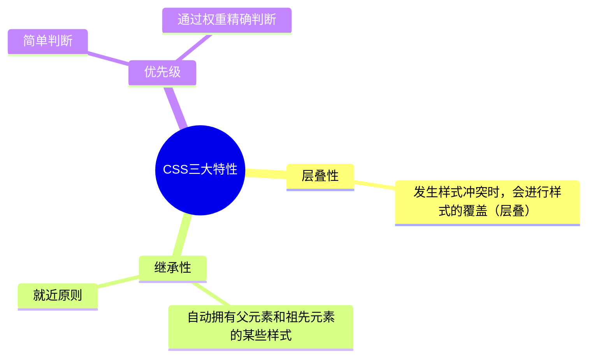

### 2.1 CSS的编写位置

==优先级：行内样式 > 内部样式 = 外部样式==

<details>
<summary>note</summary>

- 内部样式、外部样式，这二者的优先级相同，且：后面的 会覆盖 前面的（简记：“后来者居上”）
- 同一个样式表中，优先级也和编写顺序有关，且：后面的 会覆盖 前面的（简记：“后来者居上”）

</details>


**行内样式**
又称内联样式，直接写在HTML标签的 `style` 属性中，只能控制当前标签的样式，不能控制其他标签的样式，书写要符合css语法。书写繁琐、样式不能复用、并且没有体现出：结构与样式分离 的思想，不推荐大量使用，只有对当前元素添加简单样式时，才偶尔使用。

    <p style="color: red; font-size: 60px;">This is a demo!</p>

**内部样式**
写在 html 文件内部，将所有的 CSS 代码提取出来，单独放在 `style` 标签中。`style` 标签理论上可以放在 HTML 文档的任何地方，但一般都放在 `head` 标签中。此种写法：样式可以复用、代码结构清晰。并没有实现：结构与样式完全分离。多个 HTML 页面无法复用样式。

```html
<!DOCTYPE html>
<html lang="zh-CN">
<head>
    <meta charset="UTF-8">
    <title>DEMO1</title>
    <style>
        h2 {
            color: blue;
        }
    </style>
</head>
```

**外部样式**
写在单独的 .css 文件中，随后在 HTML 文件中引入使用。新建一个扩展名为 .css 的样式文件，把所有 CSS 代码都放入此文件中。在 HTML 文件中引入 .css 文件。

第一步：编写一个css文件

```css title="demo1.css" linenums="1"
h3 {
    color: gray;
}
```

第二步：在html文件中引入css文件

```html title="demo1.html" linenums="1" hl_lines="6"
<!DOCTYPE html>
<html lang="zh-CN">
<head>
    <meta charset="UTF-8">
    <title>DEMO1</title>
    <link rel="stylesheet" href="demo1.css">
</head>
```

<details>
<summary>note</summary>

- `link` 标签要写在 `head` 标签中。
- `link` 标签属性说明：
    - `href` 引入的文档的地址
    - `rel` 说明引入的文档与当前文档之间的关系，英文relation
- 外部样式的优势：样式可以复用、结构清晰、可触发浏览器的缓存机制，提高访问速度 ，实现了结构与样式的完全分离。
- 实际开发中，几乎都使用外部样式，这是最推荐的使用方式！

</details>

### 2.2 CSS语法规范和代码风格

CSS 语法规范由两部分构成：

- 选择器：找到要添加样式的元素。
- 声明块：设置具体的样式（声明块是由一个或多个声明组成的），类似于python字典的写法，声明的格式为： `属性名: 属性值;`


<details>
<summary>note</summary>

- 最后一个声明后的分号理论上能省略，但最好还是写上。
- 选择器与声明块之间，属性名与属性值之间，均有一个空格，理论上能省略，但最好还是写上。

</details>

CSS代码风格

**展开风格**
```css
h1 {
    color: red;
    font-size: 40px;
}
```

**紧凑风格**
`h1{color:red;font-size:40px;}`

<details>
<summary>tip</summary>

项目上线时，我们会通过工具将【展开风格】的代码，变成【紧凑风格】，这样可以减小文件体积，节约网络流量，同时也能让用户打开网页时速度更快。

</details>

### 2.3 CSS选择器Seclector

#### 2.3.1 基本选择器

**通配选择器 `*`**
使用通配选择器 `*` 可以选择所有html元素，可以用来清除样式

**元素选择器**
为某种html标签设置统一的样式，元素选择器无法实现差异化设置

语法：

```css
标签名 {
    属性名: 属性值;
}
```

**类选择器 `.`**
根据html标签的 `class` 属性值（类名），来选中某些元素。使用频率很高

语法：

```css
.类名 {
    属性名: 属性值;
}
```

<details>
<summary>note</summary>

- 元素的 `class` 属性值不带 `.` ，但 CSS 的类选择器要带 `.` 。
- `class` 值，是我们自定义的，按照标准：不要使用纯数字、不要使用中文、尽量使用英文与数字的组合，若由多个单词组成，使用 `-` 做连接，例如： left-menu ，且命名要有意义，做到 “见名知意”。
- 一个元素不能写多个 class 属性
- 一个元素的 class 属性，能写多个值，要用空格隔开

</details>

**id选择器 `#`**
根据html标签的 `id` 属性值，来精准选中某个元素。

语法：

```css
#id值 {
    属性名: 属性值;
}
```

<details>
<summary>note</summary>

- `id` 属性值：尽量由字母、数字、下划线 `_`、短杠 `-` 组成，最好以字母开头、不要包含空格、区分大小写。
- 一个元素只能拥有一个 id 属性，多个元素的 id 属性值不能相同。id一般是独一无二的。
- 一个元素可以同时拥有 id 和 class 属性。

</details>

#### 2.3.2 复合选择器

<details>
<summary>abstract</summary>

- 复合选择器建立在基本选择器之上，由多个基础选择器，通过不同的方式组合而成。
- 复合选择器可以在复杂结构中，快速而准确的选中元素。

</details>

> [!NOTE]
> 选择器的优先级
> 通过不同的选择器，选中相同的元素 ，并且为相同的样式名设置不同的值时，就发生了样式的冲突。到底应用哪个样式，此时就需要看优先级了。
>
> 优先级简单判断：{==行内样式 > ID选择器 > 类选择器 > 元素选择器 > 通配选择器==}
>
> 优先级判断
>
> 1. 计算方法：每个选择器，都可计算出一组权重，格式为： (a,b,c)
>     - a : ID 选择器的个数。
>     - b : 类、伪类、属性 选择器的个数。
>     - c : 元素、伪元素 选择器的个数。
> 2. 比较规则：按照从左到右的顺序，依次比较大小，当前位胜出后，后面的不再对比，例如：
>     - (1,0,0) > (0,2,2)
>     - (1,1,0) > (1,0,3)
>     - (1,1,3) > (1,1,2)
> 3. 特殊规则：行内样式权重大于所有选择器。`!important` 的权重，大于行内样式，大于所有选择器，权重最高！

> [!NOTE]
> html元素之间的关系
> html元素有五种关系：
>
> 1. 父元素：直接包裹某个元素的元素，就是该元素的父元素。
> 2. 子元素：被父元素直接包含的元素
> 3. 祖先元素：父亲的父亲......，一直往外找，都是祖先。父元素，也算是祖先元素的一种。
> 4. 后代元素：儿子的儿子......，一直往里找，都是后代。子元素，也算是后代元素的一种。
> 5. 兄弟元素：具有相同父元素的元素，互为兄弟元素


**交集选择器**
用于选中同时符合多个条件的元素。相当于且

语法：`选择器1选择器2选择器3...选择器n {}` 一般{==选择器1==}是{==元素选择器==}，之后的选择器是类选择器。交集选择器中最多只能有一个**元素选择器**。选择器和选择器之间没有使用空格分隔。

**并集选择器**
选中多个选择器对应的元素，又称：分组选择器。相当于或

语法：`选择器1, 选择器2, 选择器3, ... 选择器n {}`

<details>
<summary>note</summary>

- 并集选择器，我们一般竖着写。每个选择器使用空格分隔，并换行。
- 任何形式的选择器，都可以作为并集选择器的一部分 。
- 并集选择器，通常用于集体声明，可以缩小样式表体积

</details>

**后代选择器**
选中指定元素中，符合要求的后代元素。

语法：`选择器1 选择器2 选择器3 ...... 选择器n {}` 先写祖先，再写后代，选择器之间使用空格分隔

**子代选择器**
选中指定元素中，符合要求的子元素（儿子元素）。（先写父，再写子）

语法：`选择器1 > 选择器2 > 选择器3 > ...... 选择器n {}` 选择器之间使用 `>` 分隔

**兄弟选择器**
相邻兄弟选择器：选中指定元素后的符合条件的相邻兄弟元素。所谓相邻，就是紧挨着他的下一个。只选中一个兄弟元素

语法： `选择器1+选择器2 {}` 选择器之间使用 `+` 分隔

通用兄弟选择器：选中指定元素后的符合条件的所有兄弟元素。指定元素之后的兄弟元素，选中多个兄弟元素

语法： `选择器1~选择器2 {}` 选择器之间使用 `~` 分隔

**属性选择器**
选中属性值符合一定要求的元素。需要配合元素选择器一起使用。

语法：

- `元素选择器[属性名]` 选中具有某个属性的元素。
- `元素选择器[属性名="值"]` 选中包含某个属性，且属性值等于指定值的元素。
- `元素选择器[属性名^="值"]` 选中包含某个属性，且属性值以指定的值开头的元素。
- `元素选择器[属性名$="值"]` 选中包含某个属性，且属性值以指定的值结尾的元素。
- `元素选择器[属性名*=“值”]` 选择包含某个属性，属性值包含指定值的元素。

**伪类选择器**
选中特殊状态的元素。伪类，像类( class )，但不是类，是元素的一种特殊状态。

常用的伪类选择器：

**动态伪类**
一般对超链接 `a` 标签使用。

1. `:link` 超链接未被访问的状态。
2. `:visited` 超链接访问过的状态。
3. `:hover` 鼠标悬停在元素上的状态。
4. `:active` 元素激活的状态。激化，按下鼠标不松开
5. `:focus` 获取焦点的元素。一般对表单使用。

遵循 LVHA 的顺序，即： link 、 visited 、 hover 、 active 。
表单类元素才能使用 :focus 伪类。
当用户：点击元素、触摸元素、或通过键盘的 “ tab ” 键等方式，选择元素时，就是获得焦点。

**结构伪类**
常用结构伪类：

- `:first-child` 所有兄弟元素中的第一个。
- `:last-child` 所有兄弟元素中的最后一个。
- `:nth-child(n)` 所有兄弟元素中的第 n 个。
- `:first-of-type` 所有同类型兄弟元素中的第一个。
- `:last-of-type` 所有同类型兄弟元素中的最后一个。
- `:nth-of-type(n)` 所有同类型兄弟元素中的 第n个 。

<details>
<summary>不常用的结构伪类</summary>

- `:nth-last-child(n)` 所有兄弟元素中的倒数第 n 个。
- `:nth-last-of-type(n)` 所有同类型兄弟元素中的 倒数第n个 。
- `:only-child` 选择没有兄弟的元素（独生子女）。
- `:only-of-type` 选择没有同类型兄弟的元素。
- `:root` 根元素。
- `:empty` 内容为空元素（空格也算内容）。

</details>

<details>
<summary>结构伪类中的n</summary>

- 0 或 不写 ：什么都选不中 —— 几乎不用。
- n ：选中所有子元素 —— 几乎不用。
- 1~正无穷的整数 ：选中对应序号的子元素。
- 2n 或 even ：选中序号为偶数的子元素。
- 2n+1 或 odd ：选中序号为奇数的子元素。
- -n+3 ：选中的是前 3 个。

</details>

**否定伪类**
`:not(选择器)` 排除满足括号中条件的元素。

**UI伪类**
对于表单按钮类的标签使用。

- `:checked` 被选中的复选框或单选按钮。复选框和单选框有些样式无法通过CSS更改
- `:enable` 可用的表单元素（没有 disabled 属性）。
- `:disabled` 不可用的表单元素（有 disabled 属性）。

**目标伪类**
`:target` 选中锚点指向的元素。

**语言伪类**
`:lang()` 根据指定的语言选择元素（本质是看 lang 属性的值）。

**伪元素选择器**
选中元素中的一些特殊位置。

常用伪元素：

- `::first-letter` 选中元素中的第一个文字。
- `::first-line` 选中元素中的第一行文字。
- `::selection` 选中被鼠标选中的内容。
- `::placeholder` 选中输入框的提示文字，常用于控制输入框提示文字的颜色
- `::before` 在元素最开始的位置，创建一个子元素（css必须用 content 属性指定内容），用于批量添加前缀
- `::after` 在元素最后的位置，创建一个子元素（css必须用 content 属性指定内容），用于批量添加后缀

### 2.4 CSS三大特性



**层叠性**
如果发生了样式冲突，那就会根据一定的规则（选择器优先级），进行样式的层叠（覆盖）。

**继承性**
元素会自动拥有其父元素、或其祖先元素上所设置的某些样式。优先继承离得近的。

常见的可继承属性： `text-?? ， font-?? ， line-?? 、 color ......`

**优先级**
简单判断： {==!important > 行内样式 > ID选择器 > 类选择器 > 元素选择器 > 通配选择器 > 继承的样式==}

精确判断：需要计算权重。计算权重时需要注意：并集选择器的每一个部分是分开算的！
