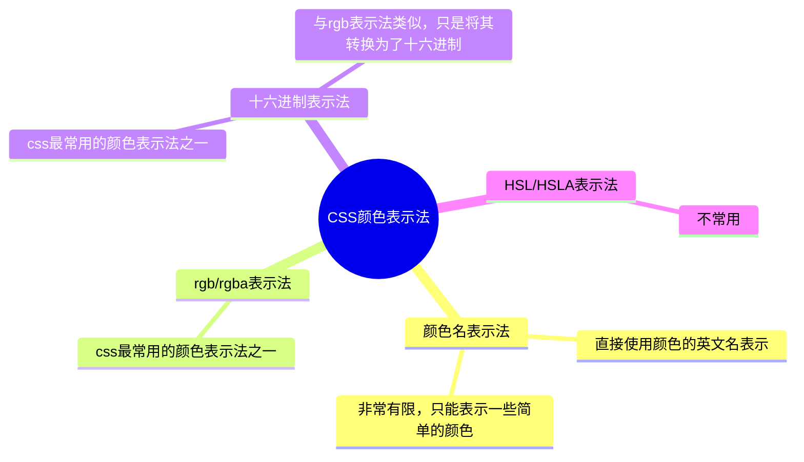

### 2.5 CSS常用属性

像素：电脑屏幕是由一个一个“小点”组成的，每个“小点”，就是一个像素px。像素点越小，呈现的内容就越清晰、越细腻。注意：电脑一般会默认开启缩放以优化用户的使用体验，因此显示的长度可能与实际的像素数不同。

**CSS颜色**



**颜色名**
编写方式：直接使用颜色对应的英文单词，编写比较简单。使用这种表示方法表示的颜色非常有限，所以用的并不多。

**rgb/rgba**
编写方式：使用 红r、绿g、蓝b 这三种光的三原色进行组合。r 表示 红色，g 表示 绿色，b 表示 蓝色，a 表示 透明度

<details>
<summary>note</summary>

- 若三种颜色值相同，呈现的是灰色，值越大，灰色越浅。
- rgb(0, 0, 0) 是黑色， rgb(255, 255,255) 是白色。
- 对于 rbga 来说，前三位的 rgb 形式要保持一致，要么都是 0~255 的数字，要么都是        百分比 。

</details>

```css
/* 使用 0~255 之间的数字表示一种颜色 */
color: rgb(255, 0, 0);/* 红色 */
color: rgb(0, 255, 0);/* 绿色 */
color: rgb(0, 0, 255);/* 蓝色 */
color: rgb(0, 0, 0);/* 黑色 */
color: rgb(255, 255, 255);/* 白色 */
/* 混合出任意一种颜色 */
color:rgb(138, 43, 226) /* 紫罗兰色 */
color:rgba(255, 0, 0, 0.5);/* 半透明的红色 */
/* 也可以使用百分比表示一种颜色（用的少） */
color: rgb(100%, 0%, 0%);/* 红色 */
color: rgba(100%, 0%, 0%,50%);/* 半透明的红色 */
```

**十六进制HEX/HEXA**
HEX 的原理同与 rgb 一样，依然是通过：红、绿、蓝色 进行组合，只不过要用 6位（分成3组） 来表达，格式为：# rrggbb

每一位数字的取值范围是： 0 ~ f ，即：（ 0, 1, 2, 3, 4, 5, 6, 7, 8, 9, a, b, c, d, e, f ），所以每一种光的最小值是： 00 ，最大值是： ff。IE 浏览器不支持 HEXA ，但支持 HEX

```css
color: #ff0000;/* 红色 */
color: #00ff00;/* 绿色 */
color: #0000ff;/* 蓝色 */
color: #000000;/* 黑色 */
color: #ffffff;/* 白色 */
/* 如果每种颜色的两位都是相同的，就可以简写*/
color: #ff9988;/* 可简为：#f98 */
/* 但要注意前三位简写了，那么透明度就也要简写 */
color: #ff998866;/* 可简为：#f986 */
```

**HSL/HSLA**
HSL 是通过：色相、饱和度、亮度，来表示一个颜色的，格式为： hsl(色相,饱和度,亮度)。色相：取值范围是 0~360 度，具体度数对应的颜色如下图：


饱和度：取值范围是 0%~100% 。（向色相中对应颜色中添加灰色， 0% 全灰， 100% 没有灰）。亮度：取值范围是 0%~100% 。（ 0% 亮度没了，所以就是黑色。 100% 亮度太强，所以就是白色了）。HSLA 其实就是在 HSL 的基础上，添加了透明度。

**字体相关属性**

**字号font-size**
字号属性 `font-size`，用于控制字体大小。常用单位px。由于字体设计原因，文字最终呈现的大小，并不一定与 font-size 的值一致，可能大，也可能小。通常情况下，文字相对字体设计框，并不是垂直居中的，通常都靠下一些。

<details>
<summary>tip</summary>

- Chrome 浏览器支持的最小文字为 12px ，默认的文字大小为 16px ，并且 0px 会自动消失。
- 不同浏览器默认的字体大小可能不一致，所以最好给一个明确的值，不要用默认大小。
- 通常以给 body 设置 font-size 属性，这样 body 中的其他元素就都可以继承了。

</details>

**字体族font-family**
字体种类属性 `font-family`，用来设置字体。

语法：

```css
div {
    font-family: "STCaiyun","Microsoft YaHei",sans-serif;
}
```

<details>
<summary>tip</summary>

1. 使用字体的英文名字兼容性会更好，具体的英文名可自行查询，或在电脑的设置里去寻找。
2. 如果字体名包含空格，必须使用引号包裹起来。
3. 可以设置多个字体，按照从左到右的顺序逐个查找，到就用，没有找到就使用后面的，且通常在最后写上 `serif` （衬线字体，笔画粗细有区别）或   `ans-serif` （非衬线字体，笔画粗细相同）。

</details>

**斜体font-style**
斜体属性 `font-style` 用来控制字体是否使用斜体字

可选值：

- normal ：正常（默认值）
- italic ：斜体（使用字体自带的斜体效果）（推荐使用）
- oblique ：斜体（强制倾斜产生的斜体效果）

**粗体font-weight**
粗体属性 `font-weight`，用于控制是否使用粗体字。

可选值：

- lighter ：细
- normal ： 正常
- bold ：粗
- bolder ：很粗 （多数字体不支持）

还可以使用数字表示粗细：

- 100~1000 且无单位，数值越大，字体越粗 （或一样粗，具体得看字体设计时的精确程度）。
- 100~300 等同于 lighter ， 400~500 等同于 normal ， 600 及以上等同于bold 。

**字体复合属性font**
字体属性 `font` ，可以把上述字体样式合并成一个属性。将上述所有字体相关的属性复合在一起编写。

编写规则：

1. 字体大小、字体族必须都写上。
2. 字体族必须是最后一位、字体大小必须是倒数第二位。
3. 各个属性间用空格隔开。

实际开发中更推荐复合写法，但这也不是绝对的，比如只想设置字体大小，那就直接用 `font-size` 属性。

**文本相关属性**

**文本颜色color**
文本颜色属性 `color`，用于控制字体颜色，属性值使用css中的颜色表示法表示，常使用 **十六进制颜色表示法HEX/HEXA** 或 **rgb/rgba颜色表示法**

**文本间距**
字母间距属性 `letter-spacing`，控制字母之间的间距

单词间距属性 `word-spacing`，控制单词之间的间距

单位是px，正值间距增大，负值间距减小

**文本修饰text-decoration**
文本修饰属性 `text-decoration`，控制下划线、删除线等各种线条

可选值：

- none ： 无装饰线（常用）
- underline ：下划线（常用）
- overline ： 上划线
- line-through ： 删除线

以上可选值可以使用下列值来修饰：

- dotted ：虚线
- wavy ：波浪线
- css颜色
  
**文本缩进text-indent**
文本缩进属性 `text-indent`，控制首行缩进。属性值是css中的长度，常用单位px

**文本水平对齐text-align**
文本水平对齐属性 `text-align`，控制文本的水平对齐方式。

可选值：

- left ：左对齐（默认值）
- right ：右对齐
- center ：居中对齐

**文本行高line-height和文本垂直对齐**
文本行高属性 `line-height`，用于控制每行文字的高度。

可选值：

- normal ：由浏览器根据文字大小决定的一个默认值。
- 像素( px )。
- 数字：参考自身 font-size 的倍数（很常用）。
- 百分比：参考自身 font-size 的百分比。

line-height的应用：

- 对于多行文字：控制行与行之间的距离。
- {==对于单行文字：让 height 等于 line-height ，可以实现文字垂直居中。==}由于字体设计原因，文字在一行中，并不是绝对垂直居中，若一行中都是文字，不会太影响观感。

<details>
<summary>行高注意事项</summary>

- 如果 `line-height` 过小文字会产生重叠，且最小值是 0 ，不能为负数。
- `line-height` 是可以继承的，且为了能更好的呈现文字，最好写数值。
- line-height 和 height 的关系：设置了 height ，那么高度就是 height 的值。不设置 height 的时候，会根据 line-height 计算高度。

</details>

<details>
<summary>height属性</summary>

height属性指定了一个元素的高度。默认情况下，这个属性决定的是内容区（ content area）的高度，但是，如果将 box-sizing 设置为 border-box , 这个属性决定的将是边框区域（border area）的高度。

</details>

顶部对齐：无需任何属性，在垂直方向上，默认就是顶部对齐。

==垂直居中对齐：对于单行文字，让 height 属性值和line-height 属性值相等即可。==

底部对齐：对于单行文字，目前一个临时的方式：让 `line-height = ( height × 2 ) - font-size - x`，其中 x 是根据字体族，动态决定的一个值。

**垂直对齐方式vertical-align**
`vertical-align` 用于控制垂直对齐方式，但是并不能做到垂直居中。用于指定同一行元素之间，或 表格单元格 内文字的 垂直对齐方式。不能控制块级元素

常用值：

- baseline （默认值）：使元素的基线与父元素的基线对齐。
- top ：使元素的顶部与其所在行的顶部对齐。
- middle ：使元素的中部与父元素的基线加上父元素字母 x 的一半对齐。
- bottom ：使元素的底部与其所在行的底部对齐

**列表相关属性**

可以作用在 ul 、 ol 、 li 标签上

**列表符号list-style-type**
属性 `list-style-type` 用于设置列表的项目符号

可选值如下：

- none ：不显示前面的标识（很常用！）
- square ：实心方块
- disc ：圆形
- decimal ：数字
- lower-roman ：小写罗马字
- upper-roman ：大写罗马字
- lower-alpha ：小写字母
- upper-alpha ：大写字母

**列表符号位置list-style-position**
设置列表符号的位置 

可选值：

- inside ：在 li 的里面
- outside ：在 li 的外边

**图片项目符号list-style-image**
属性 `list-style-image` 设置自定义项目符号，属性值 `url(图片地址)`

**列表复合属性list-style**
`list-style` 复合属性，没有数量、顺序的要求

**表格边框相关属性（其他元素也能用）**

**边框宽度border-width**
控制边框的宽度，属性值是CSS 中可用的长度值

**边框颜色border-color**
属性值是CSS 中可用的颜色值

**边框风格border-style**
想要显示出边框，必须设置次属性。否则不显示。

可选值：

- none 默认值
- solid 实线
- dashed 虚线
- dotted 点线
- double 双实线

**边框复合属性border**
border 边框复合属性 没有数量、顺序的要求，建议设置边框时直接使用此复合属性。

**表格独有属性（只有 `table` 标签才能使用）**

**表格列宽table-layout**
table-layout 设置列宽度

可选值：

- auto ：自动，列宽根据内容计算（默认值）。
- fixed ：固定列宽，平均分。

**单元格间距border-spacing**
border-spacing 单元格间距，属性值CSS 中可用的长度值。生效的前提：单元格边框不能合并。

**合并单元格边框border-collapse**
border-collapse 合并单元格边框 

可选值：

- collapse ：合并
- separate ：不合并

**隐藏空单元格empty-cells**
empty-cells隐藏没有内容的单元格，生效前提：单元格不能合并。

可选值：

- show ：显示，默认
- hide ：隐藏

**表格标题位置caption-side**
caption-side 设置表格标题位置 

可选值：

- top ：上面（默认值）
- bottom ：在表格下面

**背景属性**

**背景色background-color**
background-color 设置背景颜色 符合 CSS 中颜色规范的值。默认背景颜色是 transparent 。

**背景图片background-image**
background-image 设置背景图片，属性值 `url(图片的地址)`

**背景重复方式background-repeat**
background-repeat设置背景重复方式

可选值：

- repeat ：重复，铺满整个元素，默认值。
- repeat-x ：只在水平方向重复。
- repeat-y ：只在垂直方向重复。
- no-repeat ：不重复。


**背景图片位置background-position**
background-position 设置背景图位置

通过关键字设置位置：

写两个值，用空格隔开。水平： left 、 center 、 right。垂直: top 、 center 、 bottom

如果只写一个值，另一个方向的值取 center

通过长度指定坐标位置：

以元素左上角，为坐标原点，设置图片左上角的位置。
两个值，分别是 x 坐标和 y 坐标。只写一个值，会被当做 x 坐标， y 坐标取center

**背景复合属性background**
background 复合属性 没有数量和顺序要求

**鼠标属性cursor**

cursor 设置鼠标光标的样式

可选值:
  
- pointer ：小手
- move ：移动图标
- text ：文字选择器
- crosshair ：十字架
- wait ：等待
- help ：帮助
- url(地址) 自定义鼠标光标
