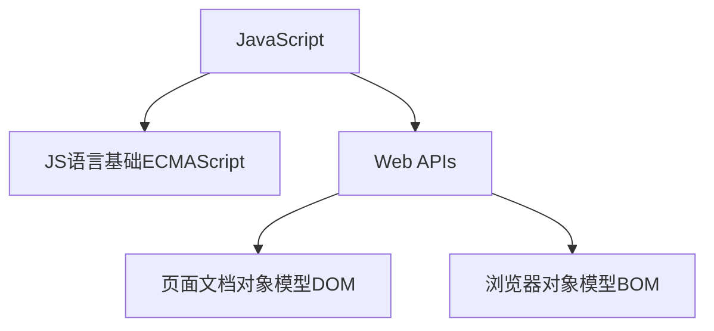

## 一、Web APIs 简介

<details>
<summary>变量声明</summary>

常用 `const` 和 `let` 关键字进行变量声明，在两者都可以使用的情况下，优先使用 `const` 进行变量声明。因为js中很多变量声明之后就不会再更改了，使用 `const` 声明变量语义化更好。

<details>
<summary>tip</summary>

- 数组和对象建议使用 `const` 进行声明，虽然数组和对象可以使用方法进行修改，但是修改时并不会改变他们的地址，因此可以使用const声明
- for循环条件中的变量需要使用let声明

</details>

</details>



### 1.1 DOM简介

DOM（Document Object Model——文档对象模型）是用来呈现以及与任意 HTML 或 XML文档交互的API，即DOM是浏览器提供的一套专门用来 操作网页内容 的功能，用来开发网页内容特效和实现用户交互

**DOM树**

将 HTML 文档以树状结构直观的表现出来，我们称之为文档树或 DOM 树，用来描述网页内容关系的名词，文档树直观的体现了标签与标签之间的关系


**DOM对象**

DOM对象：浏览器根据html标签生成的 JS对象，所有的html标签都视为DOM对象，html标签属性都可以在这个对象上面找到，修改这个对象的属性会自动映射到标签身上

DOM的核心思想 把网页内容当做对象来处理

document 对象 是 DOM 里提供的一个对象，所以它提供的属性和方法都是用来访问和操作网页内容的 例如：document.write()

网页所有内容都在document里面，document代表整个html文件

### 1.2 使用CSS选择器获取DOM元素

- `document.querySelector('css选择器')` 传入css选择器，返回CSS选择器匹配到的第一个HTMLelement对象
- `document.querySelectorAll('css选择器')` 同上，返回所有匹配元素的NodeList对象，相当于是返回一个数组
    - 这个数组并不是真正的数组，只是和数组类似
    - 可以使用数组的下标访问元素
    - 但是不能使用pop()、push()等数组方法

<details>
<summary>其他获取DOM元素的方法（不推荐使用）</summary>

- `document.getElementById()` 传入元素id值，通过id获取匹配到的第一个元素
- `document.getElementByTagName()` 传入html标签名，通过元素选择器获取匹配到的所有元素
- `document.getElementByClassName()` 传入类名，通过类选择器获取匹配到的所有元素

</details>

### 1.3 操作元素文本内容

- `对象.innerText` 属性 修改html标签的文本内容，显示纯文本，不解析html标签
- `对象.innerHTML` 属性 修改html标签的文本内容，显示纯文本，解析html标签

### 1.4 操作元素属性

**操作常用属性**

`对象.属性名 = 值` 直接通过属性名修改元素属性值，最常见的属性比如： href、title、src 等

**操作元素样式**

**直接通过style修改**
`对象.style.样式属性 = 值` 样式属性就是CSS的属性，由于CSS属性名是使用`-`来命名的，在JS中使用时统一使用小驼峰格式的命名表示CSS属性名。实际上生成的是行内样式

**使用类名className修改**
`对象.className = 值` 先使用CSS在style标签中创建一个类选择器的样式表，再将这个类的类名赋值给此对象的className属性，如果该对象原先也有类名，则会被替换，多个类名看做一个处理，值应该传入类名，而不是类选择器。

**使用classList修改（推荐）**
- `对象.classList.add(类名)` 添加类名，值应该传入类名，而不是类选择器，不会替换原有类名，而是会添加到原有类名后面
- `对象.classList.remove(类名)` 删除传入的类名
- `对象.classList.toggle(类名)` 切换对象的一个类名，如果对象原先有这个类名，则会移除，如果对象原先没有这个类名，则会添加

**操作表单属性**

- 与**操作常用属性**用法类似，但是表单属性比较特殊，表单属性一般都是通过`对象.属性名`来获取
- `对象.value` 获取input等标签的输入内容，通过赋值可以更改内容
- `对象.type` 获取input等标签的type属性值，通过赋值可以更改输入框类型
- 表单属性中的 `disabled` `checked` `selected` 等没有属性值的属性，通过js操作时将其值看作是布尔值，如果为true 代表添加了该属性 如果是false 代表移除了该属性
 
**自定义属性**

在html5中推出来了专门的`data-`自定义属性，在标签上一律以`data-`开头，在DOM对象上一律以`dataset`对象方式获取，使用dataset获取属性值时不需要写`data-`前缀

    <div data-id="demo" data-msg="hello">This is a demo!</div>
    <script>
        const div = document.querySelector('div')
        console.log(div.dataset)
        console.log(div.dataset.id) // demo
        console.log(div.dataset.msg) // hello
    </script>

### 1.5 定时器（间歇函数）

每隔一段时间，重复调用一个函数

- `setInterval(函数名或匿名函数, 间隔时间)` 开启定时器，每隔一段时间执行一次函数，间隔时间的单位是毫米，返回一个整数，表示这个定时器的ID，声明变量时使用`let`关键字
- `clearInterval(定时器ID)` 传入代表定时器ID的变量，关闭定时器

## 二、事件

### 2.1 事件监听（事件绑定）

`对象.addEventListener(事件类型, 函数名或匿名函数)` 为对象绑定一个事件，当对象触发这个事件时，会执行函数，这个函数也被称为回调函数。这种绑定事件的方法称为 `L2` 级事件绑定

<details>
<summary>回调函数</summary>

如果将函数 A 做为参数传递给函数 B 时，我们称函数 A 为回调函数。简单理解： 当一个函数当做参数来传递给另外一个函数的时候，这个函数就是回调函数。

`setInterval(函数名或匿名函数, 间隔时间)`和`对象.addEventListener(事件类型, 函数名或匿名函数)`都是将函数作为参数传递给另外一个函数，这个函数就是回调函数。

</details>

`对象.on事件类型 = 函数名或匿名函数` 为对象绑定一个事件，当对象触发这个事件时，会执行函数，这种方式不推荐使用，因为会覆盖原有的事件处理函数。这种绑定事件的方法称为 `L0` 级事件绑定

事件监听三要素：

- 事件源： DOM对象
- 事件类型： 用什么方式触发
  
    ???+ info "事件类型"
        - 鼠标事件：鼠标点击`click`、鼠标进入`mouseenter`、鼠标离开`mouseleave`

            ??? warning
                鼠标进入有两种表示方式 `mouseover`和 `mouseenter` ，鼠标离开有两种表示方式 `mouseout` 和 `mouseleave` ，二者区别如下：

                - `mouseover` 和 `mouseout` 会有冒泡效果
                - `mouseenter` 和 `mouseleave` 没有冒泡效果 (推荐)

        - 键盘事件：键盘按下`keydown`、键盘抬起`keyup`，一般使用`keyup`
        - 文本事件：用户输入`input`
        - 焦点事件：表单获得焦点`focus`、失去焦点`blur`
        - 页面加载事件：页面加载完成`load`、 DOM（HTML标签）加载完成`DOMContentLoaded`
        - 页面滚动事件：页面滚动`scroll`
        - 页面尺寸事件：页面尺寸变化`resize`
        
        ???+ info "移动端事件"
            移动端事件（M端事件），针对手机平板等触屏设备。触屏事件 `touch` ，touch 对象代表一个触摸点。触摸点可能是一根手指，也可能是一根触摸笔。触屏事件可响应用户手指（或触控笔）对屏幕或者触控板操作。M端事件一般使用JS插件完成，例如swiper插件

            [Swiper官网](https://www.swiper.com.cn/)
            
            常见的触屏事件：

            - `touchstart` 手指触摸到一个DOM元素时触发
            - `touchmove` 手指在一个DOM元素上滑动时触发
            - `touchend` 手指从一个DOM元素上移开时触发

- 事件调用的函数（回调函数）： 要做什么事

### 2.2 事件对象

事件对象：事件触发时，浏览器会自动创建一个事件对象，这个事件对象会作为参数传递给事件处理函数，我们可以在事件处理函数中使用这个事件对象，来获取事件的详细信息

一般命名为 `event` `ev` `e`，以下用 `e` 表示事件对象

`对象.addEventListener(事件类型, function (e) {})` 为对象绑定一个事件，当对象触发这个事件时，会执行函数。在事件绑定的回调函数的第一个参数 `e` 就是事件对象

<details>
<summary>事件对象常用属性</summary>

- `type` 获取当前的事件类型，即`addEventListener()`的第一个参数
- `clientX` `clientY` 获取光标相对于浏览器可见窗口左上角的位置
- `offsetX` `offsetY` 获取光标相对于当前DOM元素左上角的位置
- `key` 用户按下的键盘键的值，比如`Enter`、`Space`、`ArrowUp`、`ArrowDown`、`ArrowLeft`、`ArrowRight`等

</details>

### 2.3 环境对象this

环境对象：指的是函数内部特殊的变量 `this` ，它代表着当前函数运行时所处的环境，类似于python类的 `self`。弄清楚this的指向，可以让我们代码更简洁

- 函数的调用方式不同，this 指代的对象也不同
- 粗略判断this的指向：谁调用， this 就是谁
- 直接调用函数，其实相当于是 window.函数，所以 this 指向 window

<details>
<summary>example</summary>

```js
const btn = document.querySelector('button')
btn.addEventListener('click', function (e) {
    btn.style.backgroundColor = 'red'
    // 此处this指向对象btn，因此上面的代码也可写成：
    this.style.backgroundColor = 'red'
})
```

</details>

### 2.4 事件流

事件流：事件流指的是事件完整执行过程中的流动路径。当触发事件时，会经历两个阶段，分别是捕获阶段、冒泡阶段

- 捕获阶段：从DOM的根元素开始去执行对应的事件 （从外到里）。有同类型事件，先触发祖先元素的事件，再触发父元素的事件，最后触发子元素的事件。

    ??? info "事件捕获"
        `对象.addEventListener(事件类型, 函数名或匿名函数, true)` 第三个参数为true时，事件会在捕获阶段执行（很少使用）。第三个参数为false，代表冒泡阶段触发，默认就是false

- 冒泡阶段：当一个元素的事件被触发时，同样的事件将会在该元素的所有祖先元素中依次被触发。这一过程被称为事件冒泡。有同类型事件，先触发子元素本身的事件，再触发父元素的事件，最后触发祖先元素的事件。`对象.addEventListener(事件类型, 函数名或匿名函数, false)`或`对象.addEventListener(事件类型, 函数名或匿名函数)`
- 捕获阶段是从父到子，冒泡阶段是从子到父。实际工作都是使用事件冒泡为主

阻止冒泡 `e.stopPropagation()` 此方法可以阻断事件流动传播，不光在冒泡阶段有效，捕获阶段也有效，阻止事件冒泡需要拿到事件对象，此处用 `e` 表示

阻止默认行为 `e.preventDefault()` 此方法可以阻止默认行为，比如a标签的跳转行为，表单的提交行为，右键菜单的弹出行为等，阻止默认行为需要拿到事件对象，此处用 `e` 表示

### 2.5 解绑事件

`对象.on事件类型 = null` 适用于 L0 事件，直接使用null覆盖原有事件处理函数，将事件处理函数解绑

`removeEventListener(事件类型, 事件处理函数, [获取捕获true或者冒泡阶段false])` 适用于 L2 事件，移除对象的事件监听，第一个参数为事件类型，第二个参数为事件处理函数名。匿名函数无法被解绑，所以需要解绑时，`addEventListener()`绑定事件时不能使用匿名函数

<details>
<summary>L0和L2事件绑定的区别</summary>


</details>
- 传统on注册（L0）
    - 同一个对象,后面注册的事件会覆盖前面注册(同一个事件)
    - 直接使用null覆盖偶就可以实现事件的解绑
    - 都是冒泡阶段执行的
- 事件监听注册（L2）
    - 语法: `addEventListener(事件类型, 事件处理函数, 是否使用捕获)`
    - 后面注册的事件不会覆盖前面注册的事件(同一个事件)
    - 可以通过第三个参数去确定是在冒泡或者捕获阶段执行
    - 解绑必须使用`removeEventListener(事件类型, 事件处理函数, 获取捕获或者冒泡阶段)`
    - 匿名函数无法被解绑

### 2.6 事件委托

事件委托是利用事件流的特征解决一些开发需求的知识技巧

- 优点：减少事件绑定的次数，可以提高程序性能
- 原理：事件委托其实是利用事件冒泡的特点。给父元素注册事件，当我们触发子元素的时候，会冒泡到父元素身上，从而触发父元素的事件
- 实现：`e.target.tagName` 可以获得真正触发事件的元素的标签名（标签名采用全大写），`e` 表示事件对象，`e.target` 表示真正触发事件的元素（对象）

<details>
<summary>事件委托</summary>

```html
<ul>
    <li>事件1</li>
    <li>事件2</li>
    <li>事件3</li>
    <li>事件4</li>
    <li>事件5</li>
    <p>事件6</p>
</ul>
<script>
    const ul = document.querySelector('ul')
    ul.addEventListener('click', function(e){
        if(e.target.tagName === 'LI'){
            e.target.style.color = 'red'
        }
    })
</script>
```
点击每个li标签，都会变成红色，但是点击p标签不会变成红色，因为p标签不是li标签，所以不会触发事件，使用这种写法可以避免为每个li标签都绑定事件，提高程序性能

</details>

### 2.7 页面加载事件

加载外部资源（如图片、外联CSS和JavaScript等）加载完毕时触发的事件

1. `load` 事件：页面完全加载再执行回调函数，此时可以将script标签放在head标签内部

    给 `window` 添加 `load` 事件 `window.addEventListener('load', function(){})`，监听页面所有资源加载完毕，加载完毕之后再调用回调函数

    注意：不光可以监听整个页面资源加载完毕，也可以针对某个资源绑定load事件

2. `DOMContentLoaded` 事件：DOM（网页HTML）加载完毕再执行回调函数，而无需等待样式表、图像等完全加载，此时可以将script标签放在head标签内部。监听页面DOM加载完毕：给 `document` 添加 `DOMContentLoaded` 事件，`document.addEventListener('DOMContentLoaded', function(){})`

### 2.8 页面滚动事件

`scroll` 事件：页面滚动时触发的事件，滚动条滚动时触发。通常给 `window` （有时也给 `document` ） 添加 `scroll` 事件，监听某个元素的内部滚动直接给某个元素加即可

`scrollLeft` 和 `scrollTop` 属性： 获取滚动条滚动像素数的大小，返回数字，可以对其赋值，常使用 `scrollTop`获取竖直方向滚动的大小

开发中，我们经常检测页面滚动的距离

```js
window.addEventListener('scroll', function(){
    // document.documentElement 返回HTML标签表示的对象
    console.log(document.documentElement.scrollTop)
})
```

`元素.scrollTo(x, y)` 方法可把内容滚动到指定的坐标，x 是水平方向滚动的像素数，y 是垂直方向滚动的像素数，常用 `window.scrollTo(0, 0)` 回到顶部

### 2.9 页面尺寸事件

`resize` 事件：页面尺寸变化时触发的事件，通常给 window 添加 resize 事件，监听页面尺寸变化

获取盒子宽高 `clientWidth` 和 `clientHeight` 属性： 获取元素的可见部分宽高（盒子的宽高，不包含border和margin），返回数字，常 `clientWidth` 获取元素的可见部分宽度，`clientHeight` 获取元素的可见部分高度。`document.documentElement.clientWidth` 可以获取浏览器窗口的宽度，`document.documentElement.clientHeight` 可以获取浏览器窗口的高度

获取宽高 `offsetWidth` 和 `offsetHeight` 属性：获取元素的自身宽高（包含元素自身设置的宽高、padding、border），获取出来的是数值。获取的是可视宽高, 如果盒子是隐藏的,获取的结果是0

获取位置 `offsetLeft` 和 `offsetTop` 属性：获取元素距离自己定位父级元素的左、上距离（如果祖先元素没有开启定位，以 文档左上角为基准），可以通过这种方式获取元素在页面中的位置，从而避免使用css计算宽高，这两个属性不可以赋值

获取位置 `对象.getBoundingClientRect()`方法 返回元素的大小及其相对于视口的位置
