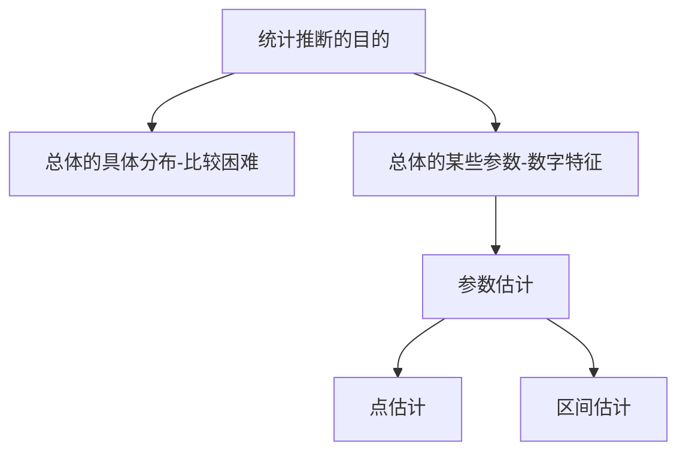

### 7.1  参数估计的概念 

参数估计的分类

- 点估计：给出未知参数的估计值
- 区间估计：给出未知参数的取值范围 

### 7.2 点估计量的求法 

#### 7.3.1 点估计的概念

设总体 $X$ 中含有未知参数 $\theta,  X_1 ,  X_2 ,  ...,  X_n $为 $X$ 的一样本．点估计就是要构造适当的统计量 $\hat{\theta} (X_1 ,  X_2 ,  ...,  X_n)$,  用其观测值 $\hat{\theta} (x_1 ,  x_2 ,  ...,  x_n)$ 作为 $\theta$ 的估计值．

点估计方法:

- 矩估计
- 最大似然估计 (极大似然估计) 

#### 7.3.2 矩估计

假设 $\theta = (\theta _1 ,  \theta _2,  ...,  \theta _l) $ 为总体 $X$ 的待估参数, 令样本矩等于总体矩：

$$
\begin{cases} 
A_1 = m_1 \\
A_2 = m_2 \\
\vdots \\
A_l = m_l
\end{cases}
$$

用方程组的解 $\hat{\theta _1} ,  \hat{\theta _2} ,  ...,  \hat{\theta _l}$ 分别作为$\theta _1 ,  \theta _2,  ...,  \theta _l$ 的估计量,  则称该估计量为矩估计量,  相应的观察值称为矩估计值．

> 具体求解中只需掌握 $l = 1,  2$ 的情形． 

note

原理 $A_k \xrightarrow{P} m_k$

- 样本矩 $A_k = \frac{1}{n} \sum _{i=1} ^n X_i ^k$
- 总体矩 $m_k = E(X^k)$

矩估计-记住此题结论

设 $X_1 ,  X_2 ,  ...,  X_n$ 为总体 $X$ 的一样本,  而 $X$ 的期望 $\mu$ 和方差 $\sigma ^2$ 都存在但未知,  试求 $\mu$ 和 $\sigma ^2$ 的矩估计量．

**解** 令 

$$
\begin{cases} 
A_1 = m_1 \\
A_2 = m_2
\end{cases}
$$

而 $A_1 = \frac{1}{n} \sum X_i = \bar{X} ,  A_2 = \frac{1}{n} \sum X_i ^2$

$m_1 = E(X ) = \mu,   m_2 = E(X ^2) = D(X ) + E^2(X ) = \sigma ^2 + \mu ^2$

所以得

$$
\begin{cases} 
\hat{\mu} = \bar{X} = A_1 \\
\hat{\sigma} ^2 = A_2 - \mu ^2 = \frac{1}{n} \sum X_i ^2 - \bar{X} ^2 = \frac{1}{n} \sum (X_i - \bar{X}) ^2 = \tilde{S} ^2
\end{cases}
$$

> 上述结果表明,  总体期望的矩估计量为样本的均值,  总体方差的矩估计量为样本的二阶中心矩． 

矩估计

设总体 $X \sim P(\lambda)$,  $\lambda$ 未知,  $X_1 ,  X_2 ,  ...,  X_n$ 是 X$ 的一个样本,  求 $\lambda$ 的矩估计量．
解 因为 $E(X ) = \lambda ,  D(X ) = \lambda$ ,  由上一题的结论：

- 总体期望的矩估计量为样本的均值,  从而可得 $\hat{\lambda} = \bar{X}$ ,  
- 总体方差的矩估计量为样本的二阶中心矩,  从而可得 $\hat{\lambda} = \frac{1}{n} \sum (X_i - \bar{X}) ^2 = \tilde{S} ^2 $

即该待估参数有两个不同的矩估计量． 

矩估计

设总体 $X \sim U[a,  b]$,  其中$a,  b$ 为未知参数,  试求 $a,  b$ 的矩估计量．

**解** 由结论得

$$
\begin{cases} 
\frac{\hat{a} + \hat{b}}{2} = \bar{X} \\
\\
\frac{(\hat{b} - \hat{a})^2}{12}  = \tilde{S} ^2
\end{cases}
\implies
\begin{cases} 
\hat{a} = \bar{X} - \sqrt{3} \tilde{S} \\
\hat{b} = \bar{X} + \sqrt{3} \tilde{S}
\end{cases}
$$

#### 7.3.3 最大似然估计

原理：大概率事件易发生

设总体X 的密度函数为 $f (x；\theta )$ (或分布律为 $p(x；\hat{\theta} )$),  $\theta = ( \theta _1, \theta _2, \cdots, \theta _l)$ 为待估参数,  称样本 $X_1 ,  X_2 ,  ...,  X_n$ 的联合密度函数(或联合分布律)为似然函数,  记为 $L(\theta )$,   即

$$
L(\theta) = f(x_1, x_2, \cdots, x_n ; \theta) = \prod _{i=1} ^n f (x_i；\theta ) , \space \theta \in \Theta \\
L(\theta) = p(x_1, x_2, \cdots, x_n ; \theta) = \prod _{i=1} ^n p (x_i；\theta ) , \space \theta \in \Theta
$$

求出 $L(\theta)$ 的最大值点 $\hat{\theta}$,  则称 $\hat{\theta}$ 为 $\theta$ 的最大似然估计值． 

最大似然估计

设总体 $X \sim B(1,  p),  p$未知,  求 $p$ 的最大似然估计量．

**解** 因 $X \sim P \set{X = x} = p^x (1- p)^{1-x},  x = 0,  1,  $ 则似然函数

$$
L(p) = \prod _{i=1} ^n p (x_i；p) = \prod _{i=1} ^n p^{x_i} (1- p)^{1-x_i} = p^{\sum x_i} (1- p)^{n - \sum x_i}
$$

取对数 $ln L( p) = (\sum x_i) ln p + (n - \sum x_i) ln(1- p)$

令 $\frac{d ln L( p)}{dp} = 0 \implies p = \frac{1}{n} \sum x_i$ 

所以 $p$ 的最大似然估计量为 $\hat{p} = \frac{1}{n} \sum x_i = \bar{X}$

<!-- 例5 设总体X \sim P(\lambda),  \lambda未知,  求 \lambda 的最大似然估计量．
\lambdax
解 因 X \sim P{X = x} = e-\lambda,  x = 0,  1,  2,  ...,   则似然函数
x!
n
\sum
x
i
n n \lambdaxi \lambdai=1
L(\lambda) =  p(x ；\lambda) =  e-\lambda= e-n\lambda,  
i
x ! x !\cdot  x !...x !
i=1 i=1 i 1 2 n
 n  n
取对数 ln L(\lambda) = \sum x ln \lambda - n\lambda - \sumln(x !),  
 
i i
 
i=1 i=1
dln L(\lambda) 1 n 1 n
令 = \sum x - n = 0  \lambda = \sum x ,  
d\lambda \lambda i n i
i=1 i=1
1 n

所以 \lambda 的最大似然估计量为 \lambda = \sum X = X ．
i
n
i=1  -->

离散型随机变量的最大似然估计的难点主要是似然函数的构造,  假如样本值已知,  似然函数有一个非常简单的构造法．设总体 $X$ 的分布律为:

$$
\begin{array}{c|cccc}
X & x_1 & x_2 & \cdots & x_n \\
\hline
P & p_1 (\theta) & p_2 (\theta) & \cdots & p_n (\theta)
\end{array}
$$

$X_1 ,  X_2 ,  ...,  X_n$ 是 $X$ 的一个样本,  且样本值已知,  已知样本值中 $x_1 ,  x_2 ,  ...,  x_k$ 分别出现了$n_1 ,  n_2 ,  ...,  n_k $ 次,  则似然函数为：

$L(\theta) = [p_1(\theta)] ^{n_1} [p_2(\theta)] ^{n_2} \cdots [p_k(\theta)] ^{n_k}$

最大似然估计-离散型

设总体 $X$ 的分布律为

$$
\begin{array}{c|cccc}
X & 1 & 2 & 3 \\
\hline
P & \theta ^2 & 2 \theta (1 - \theta) & (1 - \theta)^2
\end{array}
$$

(1,  2,  1) 为来自总体的一个样本,  求 $\theta$ 的最大似然估计．

**解** 样本中出现了2个1,  1个2,  0个3,  即 $n_1 = 2,  n_2 = 1,  n_3 = 0$

$L(\theta) = [\theta ^2] ^2 \cdot [2 \theta (1 - \theta)] ^1 \cdot [(1 - \theta)^2] ^0 = 2 \theta ^5 - 2 \theta ^6$

$L'(\theta) = 10 \theta ^4 - 12 \theta ^5 = 0$

解得 $\hat{\theta} = 0$ (舍去), $\hat{\theta} = \frac{5}{6}$

<!-- 
例7 设总体 X 的分布律为 0 < p <
 
P p2 2p(1- p) p2 1- 2p  2 
(1,  3,  0,  2,  3,  3,  1,  3) 为来自总体的一个样本,  求 p 的最大似然估计．
解 n = 1,  n = 2,  n = 1,  n = 4
0 1 2 3
L( p) =  p2 1 \cdot 2 p(1- p)2 \cdot   p2 1 \cdot 1- 2 p4= 4 p6(1- p)2(1- 2 p)4
   
ln L( p) = ln 4 + 6ln p + 2ln(1- p) + 4ln(1- 2 p)
dln L( p) 6 2 8 7 - 13
= - - = 0,  得 12 p2 -14 p + 3 = 0,  p =  0.2829
dp p 1- p 1- 2 p 12 
例8 设总体X \sim E(\lambda),  \lambda未知,  求 \lambda 的最大似然估计量．
\lambdae-\lambdax,   x \ge 0,  
解 因 X \sim f (x；\lambda) =  则似然函数
0,   x < 0,  

  n 
n \lambdan exp -\lambda\sum x ,   x ,  ...,  x \ge 0,  
  
L(\lambda) =  f (x ；\lambda) = i 1 n
  
i i=1
i=1 
0,   其它,  

dln L(\lambda) n 1
两边取对数并令 = 0  \lambda = n \sum x = ,  
i
d\lambda x
i=1
n 1

所以\lambda 的最大似然估计量为 \lambda = n \sum X = ．
i
X
i=1 
例9 设总体X \sim N(\mu,  \sigma 2),  \mu,  \sigma 2 未知,  求 \mu,  \sigma 2的最大似然估计量．
2
1 (x-\mu)
-
解 因 X \sim f (x; \mu,  \sigma 2) = e 2 ,   x \in \R,  
2\sigma 
2\pi\sigma 
n  1 n 
则似然函数 L(\mu,  \sigma 2) =  f (x ; \mu,  \sigma 2) = (2\pi\sigma 2)-n exp - \sum(x - \mu)2 ,  
2  
i 2\sigma 2 i
 
i=1 i=1
n 1 n
取对数 ln L(\mu,  \sigma 2) = - (ln 2\pi + ln \sigma 2) - \sum(x - \mu)2,  
2 2\sigma 2 i
i=1 

例9 设总体X \sim N(\mu,  \sigma 2),  \mu,  \sigma 2 未知,  求 \mu,  \sigma 2的最大似然估计量．
  1 n
[ln L(\mu,  \sigma 2)] = \sum(x - \mu) = 0,   (1)

2 i
\mu \sigma 

i=1
令 
 n 1 n

[ln L(\mu,  \sigma 2)] = - + \sum(x - \mu)2 = 0,  
(2)
 \sigma 2 2\sigma 2 2\sigma 4 i

i=1
1 n 1 n
由(1)式得 \mu = \sum x = x,  代入(2)得 \sigma 2 = \sum(x - x)2,  
i
n i
n
i=1
i=1
1 n 1 n

\mu = \sum X = X ,   \sigma 2 = \sum(X - X )2 = S2 ．
所以
i i
n n
i=1 i=1 

e-(x-\hat{\theta} ),   x \ge\hat{\theta} ,  
例10 设总体 X \sim f (x;\hat{\theta} ) = \theta 未知,  求 \theta 的最大似然

0,   x <\hat{\theta} ,  

估计量．
 n
\sum
n  n\hat{\theta} - xi
解 似然函数 L(\theta) =  f (x ;\theta) = e i=1 ,   x ,  ...,  x \ge\hat{\theta} ,  

1 n
i

i=1 0,   其它,  

 n
\sum
n\hat{\theta} - x
n i

e ,   \hat{\theta} \leq min{x },  
L(\theta) =  f (x ;\theta) = i=1
 i
i 1\leqi\leqn

i=1
0,   其它,  

要使 L(\hat{\theta} ) 达到最大,  只需取\hat{\theta} = min{x ,  x ,  ...,  x },  所以 \theta 的最大似然
1 2 n

估计量为\hat{\theta} = min{X ,  X ,  ...,  X }．
1 2 n 

例11 设 X \sim U[a,  b],  a,  b 未知,  求 a,  b 的最大似然估计量．
1 (b - a),   a \leq x \leq b,  
解 因 X \sim f (x；a,  b) = 则似然函数

0,   其它,  

 1
n ,   a \leq x ,  ...,  x \leq b,  

L(a,  b) =  f (x ；a,  b) = (b - a)n 1 n

i
i=1 
0,   其它,  
 

例11 设 X \sim U[a,  b],  a,  b 未知,  求 a,  b 的最大似然估计量．
1 (b - a),   a \leq x \leq b,  
解 因 X \sim f (x；a,  b) = 则似然函数

0,   其它,  

 1
n ,   a \leq min{x },  b \ge max{x },  

L(a,  b) =  f (x ；a,  b) = (b - a)n 1\leqi\leqn i 1\leqi\leqn i
i
i=1 
0,   其它,  

记 x = min{x },  x = max{x },  则对满足 a \leq x ,  x \leq b 的任意 a,  b 有
i (n) i (n)
1\leqi\leqn 1\leqi\leqn
1 1
L(a,  b) = \leq ,  
(b - a)n (x - x )n
(n) (1)

a,  b 的最大似然估计为 a = min{X },  b = max{X }．
i i
1\leqi\leqn 1\leqi\leqn  -->

### 7.3  估计量的评选标准 

- **无偏性** 设 $\hat{\theta}$ 是参数 $\theta$ 的估计量,  若 $E(\hat{\theta} ) = \theta$ ,  则称 $\hat{\theta}$  是 $\theta$的无偏估计量．
- **有效性** 设$\hat{\theta _1}$  与$\hat{\theta _2}$  都是 $\theta$ 的无偏估计量,  若 $D(\hat{\theta _1}  ) < D(\hat{\theta _2}  )$,   则称$\hat{\theta _1}$  比$\hat{\theta _2}$  更有效．
- **相合性** 设$\hat{\theta}$ 是 $\theta$ 的估计量,  若$\hat{\theta} \xrightarrow{p} \theta \space  (n \to \infty)$,   则称 $\hat{\theta}$  是 $\theta$ 的相合估计量． 

无偏性

证明：样本均值 $\bar{X}$ 是总体期望 $\mu$ 的无偏估计量,  样本方差 $S^2$ 是总体方差 $\sigma ^2$ 的无偏估计量．

**证** 因为 $E( \bar{X} ) = E( \frac{1}{n} \sum X_i) = \frac{1}{n} \cdot  n \mu = \mu$,  所以 $\bar{X}$ 是 $\mu$ 的无偏估计量．

又 $E(S^2) = E \large[ \frac{1}{n - 1} \sum (X_i - \bar{X} ) ^2  \large] = \frac{1}{n - 1} E( \sum X_i ^2 - n \bar{X} ^2)$

而 $E(X_i ^2) = D(X_i ) + E^2(X_i ) = \sigma ^2 + \mu ^2, \space  E(\bar{X} ^2) = D(\bar{X} ) + E^2(\bar{x} ) = \frac{ \sigma ^2}{ n} + \mu ^2$

则 $E(S^2) = \frac{1}{n -1 } \large[n(\sigma ^2 + \mu ^2) - n(\frac{ \sigma ^2}{ n} + \mu ^2) \large] = \sigma ^2$

所以 $S^2$ 是 $\sigma ^2$ 的无偏估计量． 

---

由于 $S^2$ 是 $\sigma ^2$ 的无偏估计量,   且 $\tilde{S}^2 = \frac{n - 1}{n} S^2$ ,  

因此 $E( \tilde{S}^2 ) = \frac{n-1}{n} E(S^2) = \frac{n-1}{n} \sigma ^2$ ,   所以  $\tilde{S}^2$  不是 $\sigma ^2$ 的无偏估计量．

> 虽然 $S^2$ 是 $\sigma ^2$ 的无偏估计量,   但是 $S$ 并不是 $\sigma$  的无偏估计量．事实上,  由于 $D(S) = E(S^2) - E^2(S)$ ,  得 $E(S) = \sqrt{ E(S^2) - D(S) } = \sqrt{ \sigma ^2 - D(S) } \not = \sigma  $

有效性

设 $(X_1 ,  X_2 ,  X_3 )$ 为来自总体 $N(\mu,  1)$ 的一个样本,   $\mu$ 未知,  则下列 $\mu$ 的无偏估计量中最有效的是 (A)．

- [x] (A) $\frac{1}{2} X_1 + \frac{1}{3} X_2 + \frac{1}{6} X_3$
- [ ] (B) $\frac{1}{2} X_1 + \frac{1}{4} X_2 + \frac{1}{4} X_3$
- [ ] (C) $\frac{1}{3} X_1 + \frac{1}{3} X_2 + \frac{1}{3} X_3$
- [ ] (D) $ X_1 +  X_2 - X_3$

**解析** 

- $D(\frac{1}{2} X_1 + \frac{1}{3} X_2 + \frac{1}{6} X_3) = \frac{1}{4} + \frac{1}{9} + \frac{1}{36} = \frac{7}{18}$
- $D(\frac{1}{2} X_1 + \frac{1}{4} X_2 + \frac{1}{4} X_3) = \frac{1}{4} + \frac{1}{16} + \frac{1}{16} = \frac{3}{8}$
- $D(\frac{1}{3} X_1 + \frac{1}{3} X_2 + \frac{1}{3} X_3) = \frac{1}{9} + \frac{1}{9} + \frac{1}{9} = \frac{1}{3}$
- $D(X_1 +  X_2 - X_3) = 1 + 1 + 1 = 3$

### 7.4  区间估计 

abstract

- **点估计的缺陷** 未能反映出估计值$\hat{\theta}$ 与真实值 $\theta$ 之间的误差及可靠性．
- **区间估计的思想** 对未知参数$\theta$,  构造两统计量$\theta _1$ 与$\theta _2$  ,   使得 $\theta$ 能以较大的概率落在随机区间 $[\theta _1 ,  \\theta _2  ]$ 内,  由相应的观测值来估计$\theta$ 的取值范围．

$P \set{\theta _1  \leq \theta \leq \theta _2}$ —可信程度 

$E(\theta _2  - \theta _1)$ —精确程度

最优区间估计：可信度给定情况下区间尽量短． 

#### 7.4.1 置信区间的概念及其求法

定义 设总体 $X$ 含未知参数$\theta$,  对于给定的 $\alpha \in (0,  1)$,  若存在两个统计量 $\theta _1 (X_1 ,  X_2 ,  ...,  X_n)$ 和 $\theta _2 (X_1 ,  X_2 ,  ...,  X_n)$,   使得 $P \set{\theta _1  \leq \theta \leq \theta _2} = 1- \alpha$, 则称 $[\theta _1 ,  \theta _2]$ 为 $\theta$ 的置信度为 $1- \alpha$ 的置信区间．

置信区间

设总体 $X \sim N(\mu,  \sigma ^2)$,  其中 $\sigma  = \sigma _0$  已知,   $\mu$ 未知, $X_1 ,  X_2 ,  ...,  X_n$ 是 $X$ 的样本,  求 $\mu$ 的置信度为 $1- \alpha$ 的置信区间． 

inline end

解 因 $\sigma  = \sigma _0$  已知,  则由抽样分布知 $U = \frac{\bar{X} -\mu}{\sigma} \sqrt{n} $ 只包含未知参数 $\mu$ 且服从 $N(0,  1)$ ,  现需找一尽量短的区间,  使得 $U$ 落在该区间内的概率为 $1- \alpha$．由分位数的定义知 $P{-u_{1 - \alpha /2} \leq U \leq u_{1 - \alpha /2} } = 1- \alpha$

即 $P \set{-u_{1 - \alpha /2} \leq \frac{\bar{X} -\mu}{\sigma} \sqrt{n} \leq u_{1 - \alpha /2} } = 1 - \alpha$

因此 $\mu$ 的置信度为 $1- \alpha$ 的置信区间为 $\large[ \bar{X} - \frac{\sigma}{\sqrt{n}} u_{1 - \alpha /2},\bar{X} + \frac{\sigma}{\sqrt{n}} u_{1 - \alpha /2} \large]$

求解步骤

1. 构造一个只包含待估参数 $\theta$ 的样本的函数 $U$ ,  要求它的分布已知(一般由抽样分布可得)
2. 寻求一尽量短的区间 $[a,  b]$,  使得 $U$ 落在该区间内的概率为 $1- \alpha$ (一般由分位数可得)
3. 从 $a \leq U \leq b$ 中得到等价不等式 $\theta _1 \leq \theta \leq \theta _2$ ,  则$[\theta _1 ,  \theta _2 ] $ 就是 $\theta$ 的置信度为 $1- \alpha$ 的置信区间． 

#### 7.4.2 单个正态总体的情形

设总体 $X \sim N(\mu,  \sigma ^2),  X_1 ,  X_2 ,  ...,  X_n$ 是 $X$ 的一个样本,  对给定置信度 $1- \alpha$ ,  求 $\mu$ 和 $\sigma ^2$ 的置信区间．

{==问题一: 求 $\mu$ 的置信区间==}

**当 $\sigma ^2$ 已知时**

上一题可知,   $\mu$ 的置信度为 $1- \alpha$ 的置信区间为

$$
\large[ \bar{X} - \frac{\sigma}{\sqrt{n}} u_{1 - \alpha /2}, \bar{X} + \frac{\sigma}{\sqrt{n}} u_{1 - \alpha /2} \large]
$$

**当 $\sigma ^2$ 未知时**

inline end

因为 $S^2$ 是 $\sigma  ^2 $ 的无偏估计,  所以可以用$S $代替 $\sigma$ ,  则由抽样分布知 $T = \frac{\bar{X} -\mu}{S} \sqrt{n} \sim t(n-1) $

由分位数 $P \set{-t_{1 - \alpha /2} (n -1) \leq T \leq t_{1 - \alpha /2} (n -1)} = 1- \alpha$

即 $P \set{-t_{1 - \alpha /2} (n -1) \leq \frac{\bar{X} -\mu}{S} \sqrt{n} \leq t_{1 - \alpha /2} (n -1)} = 1- \alpha$

所以 $\mu$ 的置信度为 $1- \alpha$ 的置信区间为 

$$
[\bar{X} - \frac{S}{\sqrt{n}}t_{1 - \alpha /2}, \bar{X} + \frac{S}{\sqrt{n}}t_{1 - \alpha /2}]
$$

---

方差已知

某厂生产的节能灯寿命 $X \sim N(\mu,  8)$,  从生产的一批灯中抽取10只作寿命测试,  数据如下(小时)：1050,  1100,  1080,  1120,  1200,  1250,  1040,  1130,  1300,  1200 试估计这批节能灯平均寿命的范围 ( $\alpha   =   0.05 $ )．

**解** 这是在方差已知的情况下对期望进行区间估计．因为 $\bar{X} = 1147,  u_{1 - \alpha /2} = u_{0.975} =1.96$,  从而可得

- $\bar{X} - \frac{\sigma}{\sqrt{n}} u_{1 - \alpha /2} = 1145.25$
- $\bar{X} + \frac{\sigma}{\sqrt{n}} u_{1 - \alpha /2} = 1148.75$

所以这批节能灯平均寿命 $\mu$ 在0.95的置信水平下的置信区间为$[1145.25,  1148.75]$．(区间长度为3.5)

方差未知

若上一题中的方差未知,  求这批节能灯平均寿命 $\mu$ 的置信水平为0.95的置信区间． 

> $1 - \alpha = 0.95 \implies \alpha = 0.05$

**解** 这是在方差未知的情况下对期望进行区间估计．由上一题的数据计算标准差 $S = \sqrt{S^2} \approx 87.06$,  类似得置信水平为0.95的置信区间为 $[1084.72,  1209.28]$(长度为124.56)

> 此题表明,  由于对总体的了解少了(方差未知),  因而在相同的置信水平下估计的效果也就差很多． 

{==问题二: 求 $\sigma ^2$ 的置信区间==}

**当 $\mu$ 已知时**

inline end

因 $\mu = \mu _0$ 已知,  则由抽样分布知 $\chi ^2 = \frac{1}{\sigma ^2} \sum (X_i - \mu) ^2$ 只包含未知参数 $\sigma ^2$ 且服从 $\chi ^2(n)$,  现需找一尽量短的区间,  使得 $\chi ^2$ 落在该区间内的概率为 $1- \alpha$

由分位数定义 $P \set{\chi _{\alpha /2} ^2 (n) \leq \chi ^2 \leq \chi _{1 - \alpha /2} ^2 (n)} = 1- \alpha$

所以 $\sigma ^2$ 的置信度为 $1- \alpha$ 的置信区间为： 

$$
\big[\frac{\sum _{i=1} ^n (X_i - \mu)^2}{\chi _{1 - \alpha /2} ^2 (n)}, \space \frac{\sum _{i=1} ^n (X_i - \mu)^2}{\chi _{\alpha /2} ^2 (n)}  \big]
$$

**当 $\mu$ 未知时**

因为 $\bar{X}$ 是 $\mu$ 的无偏估计,  所以可以用 $\bar{X}$ 代替 $\mu$ ,  则由抽样分布知

$\frac{(n -1)S^2}{\sigma ^2} = \sigma ^2 \sum (X_i - \bar{X} )^2 \sim \chi ^2 (n -1)$

类似可得 $\sigma ^2$ 的置信度为 $1- \alpha$ 的置信区间为：

$$
\big[\frac{\sum _{i=1} ^n (X_i - \mu)^2}{\chi _{1 - \alpha /2} ^2 (n-1)}, \space \frac{\sum _{i=1} ^n (X_i - \mu)^2}{\chi _{\alpha /2} ^2 (n-1)}  \big]
$$

---

期望已知

从总体 $X \sim N(0 ,  \sigma ^2)$ 中抽取一个容量为4的样本：1.3 , −2.78 , 0.06 , 1.98, 试求 $\sigma ^2$ 的置信水平为0.95的置信区间．

**解** 这是在期望已知的情况下对方差进行区间估计．

因为 $\sum (x_i - 0) ^2 =13.34 ,   \chi _{\alpha / 2} ^2 (n) = 0.484, \chi _{1 - \alpha / 2} ^2 (n) = 11.143$  

所以可得 $\sigma ^2$ 置信水平为0.95的置信区间为 $[\frac{13.34}{11.143}, \frac{13.34}{0.484}]$

> 需要查表

