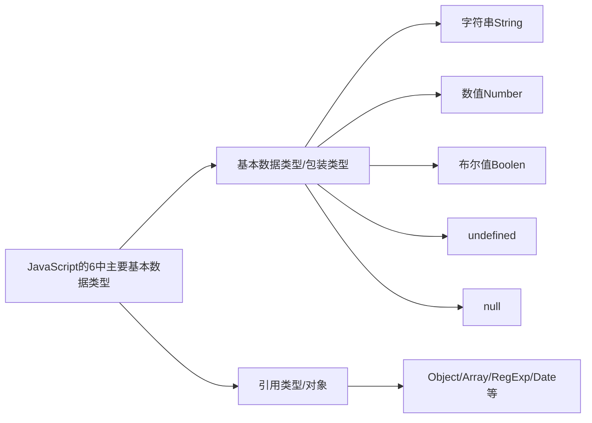

声明对象的两种方式：

- 方式一 `let 对象名 = {}`
- 方式二 `let 对象名 = new Object()`

对象由属性和方法组成：

```js
let 对象名 = {
    属性名: 属性值,
    方法名: 函数
}
```

- 对象中的属性名和属性值类似于python中的字典
- 属性名值对使用逗号分隔
- 属性名可以使用 "" 或 ''包裹，一般情况下省略，除非名称遇到特殊符号如空格、连字符、下划线等

**操作对象：**

- 查询属性值：类似于python中的对象，可以使用 `.属性名` 访问对象属性值；也类似于python中的字典，可以使用 `对象名[属性名]` 来访问属性值，属性名需要使用单引号或双引号包裹
- 更改属性值：类似于python中的对象和字典，可以对属性重新赋值
- 新增属性：操作同上，如果属性不存在，则会新增属性
- 删除属性：通过属性名删除属性 `delete 对象名.属性名`
- 对象中的方法：定义在对象中的函数就是方法，方法中也可以定义函数参数。调用方法类似于python中的方法
    ```js
    let obj = {
        sayHi: function() {
            alert('hi')
        }
    }
    ```

使用 `for in` 语句遍历对象，类似于python字典的遍历，此处获取属性值必须使用类似于python字典的写法：

```js
let obj = {
    name: 'jack',
    age: 10,
    gender: 'male'
}
for (let k in obj) {
    console.log(k) // 属性名
    console.log(obj[k]) // 属性值
}
```

**内置对象：**

类似于python中的标准库。

内置对象 `Math` 提供一系列和数学计算相关的方法

- random：生成0-1之间的随机数（包含0不包括1）
- ceil：向上取整
- floor：向下取整
- max：找最大数
- min：找最小数
- pow：幂运算
- abs：绝对值

<details>
<summary>生成随机整数</summary>

```js
// 生成0到10之间的随机整数
Math.floor(Math.random * 11)
// 生成5到10之间的随机整数
Math.floor(Math.random * 6) + 5
// 生成N到M之间的随机整数
Math.floor(Math.random * (M - N + 1)) + N 
```

</details>

## 对象进阶

### 4.1 创建对象的三种方式

- 方式一: 通过字面量创建

    ```js
    // 通过字面量创建
    const obj = {
        name: 'wq',
        age: 18
    }
    ```

- 方式二: new Object

    ```js
    // new Object
    const obj = new Object({
        name: 'wq',
        age: 18
    })
    ```

- 方式三: 利用构造函数创建对象

### 4.2 构造函数

构造函数 ：是一种特殊的函数，主要用来初始化对象. 可以通过构造函数来快速创建多个类似的对象. 类似于 Python 通过类的实例化创建对象. 构造函数在技术上是常规函数

```js
function Person(name, age) {
    this.name = name
    this.age = age
}

const person1 = new Person('wq', 18)
console.log(person1) // {name: 'wq', age: 18}

const person2 = new Person('jerry', 20)
console.log(person2) // {name: 'jerry', age: 20}
```

<details>
<summary>note</summary>

- 它们的命名以大写字母开头, 大驼峰命名法
- 它们只能由 `new` 操作符来执行
- 使用 `new` 关键字调用函数的行为被称为实例化
- 实例化构造函数时没有参数时可以省略 `()`
- 构造函数内部无需写 `return`，返回值即为新创建的对象
- 构造函数内部的 `return` 返回的值无效，所以不要写 `return`
- `new Object()` `new Date()` 也是实例化构造函数

</details>

<details>
<summary>实例化执行过程</summary>

- 创建新对象
- 构造函数this指向新对象
- 执行构造函数代码，修改this，添加新的属性
- 返回新对象

</details>

### 4.3 实例成员和静态成员

实例成员：通过构造函数创建的对象称为实例对象，实例对象中的属性和方法称为实例成员。类似于 Python 中的实例属性和实例方法.

<details>
<summary>note</summary>

- 实例对象的属性和方法即为实例成员
- 为构造函数传入参数，动态创建结构相同但值不同的对象
- 构造函数创建的实例对象彼此独立互不影响。

</details>

静态成员：构造函数的属性和方法被称为静态成员. 类似于 Python 类属性和类方法.

<details>
<summary>note</summary>

- 构造函数的属性和方法被称为静态成员
- 一般公共特征的属性或方法静态成员设置为静态成员
- 静态成员方法中的 this 指向构造函数本身

</details>

### 4.4 内置构造函数



字符串、数值、布尔、等基本类型也都有专门的构造函数，这些我们称为包装类型。JS中几乎所有的数据都可以基于构成函数创建。

#### 4.4.1 对象Object

`Object` 是内置的构造函数，用于创建普通对象。 推荐使用字面量方式声明对象，而不是 Object 构造函数

```js
// 使用构造函数创建对象
// const user = new Object({
//     name: 'wq',
//     age: 18
// })

// 通过字面量创建对象
const user = {
    name: 'wq',
    age: 18
}
```

不使用对象的静态方法时, 要想要遍历对象的值需要使用 `for (in)` 语句

```js
const user = {
    name: 'wq',
    age: 18
}

for (let key in user) {
    console.log(key) // 遍历user对象的属性
    console.log(user[key]) // 遍历user对象的属性值
}
```

这种方法明显不够简便, 使用对象的静态方法可以简化此过程.

对象的三个常用静态方法:

- `Object.keys()` 传入对象,获取对象的全部属性,返回属性列表, 类似于Python字典的 `.keys()` 方法,只不过Python字典的 `.keys()`方法只用于遍历

    ```js
    const user = {
        name: 'wq',
        age: 18
    }
    
    const arr = Object.keys(user)
    console.log(arr) // ['name', 'age']]
    ```

- `Object.values()` 传入对象,获取对象的全部属性值,返回属性值列表, 类似于Python字典的 `.values()` 方法

    ```js
    const user = {
        name: 'wq',
        age: 18
    }
    
    const arr = Object.values(user)
    console.log(arr) // ['wq', 18]]
    ```

- `Object.assign(obj1, obj2)` 将obj2拷贝到obj1, 常用于对象添加属性

    ```js
    const obj1 = {}
    const obj2 = {
        name: 'wq',
        age: 18
    }
    Object.assign(obj1, obj2)  
    console.log(obj1) // {name: 'wq', age: 18}  
    ```

    ```js
    const user = {
        name: 'wq',
        age: 18
    }
    Object.assign(user, {hobby: 'python'})
    console.log(user) // {name: 'wq', age: 18, hobby: 'python'}
    ```

#### 4.4.2 数组Array

`Array` 是内置的构造函数，用于创建数组. 创建数组建议使用字面量创建，不用 Array构造函数创建

```js
// 使用构造函数创建数组
// const arr = new Array(1, 2, 3) // 不需要方括号
// console.log(arr) // [1, 2, 3]

// 使用字面量创建数组
const arr = [1, 2, 3]
```

数组常用实例方法:

- `.forEach()` 遍历数组, 无返回值

    `.forEach()` 方法用于调用数组的每个元素，并将元素传递给回调函数. 这个方法没有返回值,它的作用就是遍历数组, 类似于python的`enumerate()`函数

    语法:

    ```js
    arr.forEach(function(item, index) {
        // 函数体
    })

    // 或
    arr.forEach(function(item) {
        // 函数体
    })
    ```

    === "Python"
        ```py
        mylist = ['py', 'c', 'js', 'css']
        for index, item in enumerate(mylist):
            print(index) # 遍历下标
            print(item) # 遍历列表
        ```

    === "JavaScript"
        ```js
        const arr = ['py', 'c', 'js', 'css']

        // forEach可以同时遍历数组元素和下标
        arr.forEach(function(item, index) {
            console.log(item) // 遍历数组
            console.log(index) // 遍历下标
        })
        ```

- `.filter()` 过滤数组, 筛选数组元素,返回新数组

    `.filter()` 方法创建一个新的数组，新数组中的元素是通过检查指定数组中符合条件的所有元素. 用于筛选数组符合条件的元素，并返回筛选之后元素的新数组

    语法:

    ```js
    arr.filter(function(item, index){
        return 筛选条件
    })

    // 或
    arr.filter(function(item){
        return 筛选条件
    })
    ```

    返回值：返回数组，包含了符合条件的所有元素。如果没有符合条件的元素则返回空数组. 因为返回新数组，所以不会影响原数组

    ```js
    const arr = [51, 2, 7, 15, 37, 20]

    const newArr = arr.filter(function(item, index){
        return item > 20
    })
    console.log(newArr) // [51, 37]
    ```

- `.map()` 迭代数组

    数组的 `.map(function (item, index) {})` 方法, 类似于python列表推导式,可以用于产生新数组. 也类似于python列表遍历的 `enumerate()` 函数,可以同时遍历数组的元素和下标(但是这种遍历方法不推荐使用,因为 `.map()` 方法是用来产生新元组的).

    语法:

    ```js
    const arr = ['py', 'js', 'html', 'css']
    const newArr = arr.map(function (item, index) {
        console.log(item, index) // 遍历数组,依次输出数组元素和下标
        return item + '语言'
    })
    console.log(newArr) // ['py语言', 'js语言', 'html语言', 'css语言']
    ```

- `.reduce()` 累加器, 用于数组求和

    基本语法: `arr.reduce(function(累计值, 当前元素, 索引号, 原数组){}, 起始值)` 起始值可以省略，如果写就作为第一次累计的起始值. 索引号和原数组可省略

    ???+ note
        - 如果有起始值，则以起始值为准开始累计， 累计值 = 起始值
        - 如果没有起始值， 则累计值以数组的第一个数组元素作为起始值开始累计
        - 后面每次遍历就会用后面的数组元素 累计到 累计值 里面 （类似求和里面的 sum ）
        - 有起始值最后的求和结果相当于没有起始值时的结果加上起始值

    ```js
    const arr = [1, 7, 6]

    // 无起始值
    // const total = arr.reduce(function(prev, current){
    //     return prev + current
    // })
    // 使用箭头函数
    const total1 = arr.reduce((prev, current) => prev + current)
    console.log(total1) // 14

    // 有起始值
    const total2 = arr.reduce((prev, current) => prev + current, 10)
    console.log(total2) // 24
    ```

- `.join()` 将数组元素拼接为字符串,返回字符串

    数组的 `.join()`  可以用来将数组中的元素拼接为一个字符串, 类似于python中的 `','.join(list)` 方法,只不过js中的 `.join()` 不传参时,相当于传入了默认值 `','`

    ```js
    const arr = ['py', 'js', 'html', 'css']
    const newArr1 = arr.join()
    console.log(newArr1) // py,js,html,css
    const newArr2 = arr.join('')
    console.log(newArr2) // pyjshtmlcss
    ```

- `.find()` 查找元素,符合测试条件的第一个数组元素值，如果没有符合条件的则返回 `undefined`

    ```js
    const arr = [
        {
            lang: 'python',
            suffix: 'py'
        },
        {
            lang: 'javascript',
            suffix: 'js'
        }
    ]
    
    const js = arr.find(function(item){
        return item.suffix === 'js'
    })
    console.log(js) // {lang: 'javascript', suffix: 'js'}
    ```

- `.every()`  检测数组所有元素是否都符合指定条件，如果所有元素都通过检测返回true，否则返回false
- `.some()`  检测数组中的元素是否满足指定条件如果数组中有元素满足条件返回true，否则返回false
- `.concat()` 合并两个数组，返回生成新数组
- `.sort()` 对原数组单元值排序
- `.splice()` 删除或替换原数组单元
- `.reverse()` 反转数组
- `.findIndex()` 查找元素的下标
- 静态方法 `Array.from()` 将伪数组转换为数组

#### 4.4.3 字符串String

在 JavaScript 中的字符串、数值、布尔具有对象的使用特征，如具有属性和方法. 之所以具有对象特征的原因是字符串、数值、布尔类型数据是 JavaScript 底层使用 Object 构造函数“包装”来的，被称为包装类型。

- `.length`属性 用来获取字符串的长度
- `.split('分隔符')` 用来将字符串拆分成数组, 和数组的`.join()`功能相反

    ```js
    // 将字符串拆分为数组
    const str = 'js,html,css'
    const arr = str.split(',')
    console.log(arr) // ['js', 'html', 'css']
    // 将数组拼接为字符串
    const str2 = arr.join()
    console.log(str2) // js,html,css
    ```

- `.substring(开始下标[,结束下标])` 用于字符串截取,类似于python字符串的切片

    ```js
    const str = 'Hello world!'
    const newStr = str.substring(3)
    console.log(newStr) // lo world!
    ```

- `.startsWith(检测字符串[，检测位置索引号])` 检测是否以某字符开头,返回布尔值
- `.includes(搜索的字符串[，检测位置索引号])` 判断一个字符串是否包含在另一个字符串中，根据情况返回true 或false
- `.toUppercase()` 用于将字母转换成大写
- `.toLowerCase()` 用于将字母转换成小写
- `.indexOf()` 检测是否包含某字符
- `.endsWith()` 检测是否以某字符结尾,返回布尔值
- `.replace()` 用于替换字符串，支持正则匹配
- `.match()` 用于查找字符串，支持正则匹配

#### 4.4.4 数组Number

`Number` 是内置的构造函数，用于创建数值

常用方法： `toFixed()` 设置保留小数位的长度,四舍五入

```js
const num = 3.1415
console.log(num.toFixed(3)) // 3.142
```

## 面向对象

前端语言主要使用面向过程(函数式编程)

### 5.1 编程思想

面向过程就是分析出解决问题所需要的步骤，然后用函数把这些步骤一步一步实现，使用的时候再一个一个的依次调用就可以了。面向过程，就是按照我们分析好了的步骤，按照步骤解决问题. 函数式编程

面向对象是把事务分解成为一个个对象，然后由对象之间分工与合作. 面向对象是以对象功能来划分问题，而不是步骤

在面向对象程序开发思想中，每一个对象都是功能中心，具有明确分工。面向对象编程具有灵活、代码可复用、容易维护和开发的优点，更适合多人合作的大型软件项目。 面向对象的特性： 封装性, 继承性, 多态性.

- 面向过程编程
    - 优点：性能比面向对象高，适合跟硬件联系很紧密的东西，例如单片机就采用的面向过程编程。
    - 缺点：没有面向对象易维护、易复用、易扩展
- 面向对象编程
    - 优点：易维护、易复用、易扩展，由于面向对象有封装、继承、多态性的特性，可以设计出低耦合的系统，使系统 更加灵活、更加易于维护
    - 缺点：性能比面向过程低

### 5.2 构造函数

封装是面向对象思想中比较重要的一部分，js面向对象可以通过构造函数实现的封装。 同样的将变量和函数组合到了一起并能通过 this 实现数据的共享，所不同的是借助构造函数创建出来的实例对象之间是彼此不影响的, 因此存在浪费内存的问题

<details>
<summary>note</summary>

- 构造函数体现了面向对象的封装特性
- 构造函数实例创建的对象彼此独立、互不影响

</details>

```js
function User(name, age) {
    this.name = name,
    this.age = age
    this.sayHi = function(){
        console.log('Hello world!')
    }
}

const bob = new User('bob', 10)
const mike = new User('mike', 20)
console.log(bob.sayHi === mike.sayHi) // false 
// 这说明不同对象的方法占据了不同的内存空间,因此造成了内存浪费
```

### 5.3 原型

#### 5.3.1 原型对象 `prototype`

通过原型可以解决前面构造函数造成的内存浪费.

构造函数通过原型分配的函数是所有对象所 共享的。 JavaScript 规定，每一个构造函数都有一个 prototype 属性，指向另一个对象，所以我们也称为原型对象.  这个对象可以挂载函数，对象实例化不会多次创建原型上函数，节约内存. 我们可以把那些不变的方法，直接定义在 prototype 对象上，这样所有对象的实例就可以共享这些方法。 构造函数和原型对象中的this 都指向 实例化的对象

使用原型改进前面的构造函数:

```js
function User(name, age) {
    this.name = name,
    this.age = age
}
User.prototype.sayHi = function(){
    console.log('Hello world!')
}

const bob = new User('bob', 10)
const mike = new User('mike', 20)
console.log(bob.sayHi === mike.sayHi) // true 
// 解决了以前写法造成的内存浪费
```

#### 5.3.2 constructor 属性

每个原型对象里面都有个`constructor` 属性（`constructor` 构造函数）. 作用：该属性指向该原型对象的构造函数

使用场景：如果有多个对象的方法，我们可以给原型对象采取对象形式赋值.但是这样就会覆盖构造函数原型对象原来的内容，这样修改后的原型对象 `constructor` 就不再指向当前构造函数了.此时，我们可以在修改后的原型对象中，添加一个 `constructor` 指向原来的构造函数。

```js
function User(){}

// 为User构造函数添加方法

// 追加方式添加
// User.prototype.sayHi = function(){
//     console.log('Hello World!')
// }
// User.prototype.hobby = function(){
//     console.log('I like js!')
// }

// 修改原型添加
User.prototype = {
    constructor: User, // 如果没有这行代码,User.prototype.constructor将指向Object
    sayHi: function(){
        console.log('Hello World!')
    },
    hobby: function(){
        console.log('I like js!')
    }
}
console.log(User.prototype.constructor) // 指向 User
```

#### 5.3.3 对象原型 `__proto__`

构造函数可以创建实例对象，构造函数还有一个原型对象，一些公共的属性或者方法放到这个原型对象身上.

对象都会有一个属性 `__proto__` 指向构造函数的 `prototype` 原型对象，之所以我们对象可以使用构造函数 `prototype` 原型对象的属性和方法，就是因为对象有 `__proto__` 原型的存在

<details>
<summary>note</summary>

- `__proto__` 是JS非标准属性
- `[[prototype]]`和`__proto__`意义相同
- 用来表明当前实例对象指向哪个原型对象 `prototype`
- `__proto__` 对象原型里面也有一个 `constructor` 属性，指向创建该实例对象的构造函数

</details>

<details>
<summary>note</summary>

- `prototype` 是 **原型(原型对象)** ,构造函数都自动有原型
- `prototype` 原型 和 对象原型 `__proto__` 里面都有 `constructor` 属性, 这个属性都指向创建实例对象/原型的构造函数
- `__proto__` 属性在实例对象里面,指向原型 `prototype`

</details>

#### 5.3.4 原型继承

继承是面向对象编程的另一个特征，通过继承进一步提升代码封装的程度，JavaScript 中大多是借助原型对象实现继承的特性。

```js
function Dog() {
    this.eyes = 2
    this.ears = 2
}

// 继承Dog()
function PetDog() {}
PetDog.prototype = new Dog()
PetDog.prototype.constructor = PetDog
// 为PetDog()定义新方法
PetDog.prototype.sit = function(){
    console.log('Sit down.')
}
```

#### 5.3.5 原型链

基于原型对象的继承使得不同构造函数的原型对象关联在一起，并且这种关联的关系是一种链状的结构，我们将原型对象的链状结构关系称为原型链

<details>
<summary>原型链-查找规则</summary>

- 当访问一个对象的属性（包括方法）时，首先查找这个对象自身有没有该属性。
- 如果没有就查找它的原型（也就是 `__proto__` 指向的 `prototype` 原型对象）
- 如果还没有就查找原型对象的原型（`Object`的原型对象）
- 依此类推一直找到 `Object` 为止（null）
- `__proto__` 对象原型的意义就在于为对象成员查找机制提供一个方向，或者说一条路线
- 可以使用 `instanceof` 运算符用于检测构造函数的 `prototype` 属性是否出现在某个实例对象的原型链上

</details>
